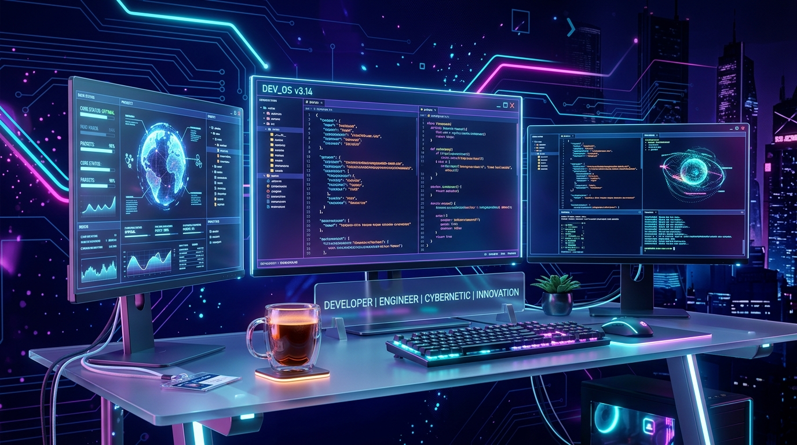

# <!-- ============================================================ -->
<!--   SUGUMARAN J — MODERN GITHUB PROFILE                          -->
<!-- ============================================================ -->

<p align="center">
  
</p>

<h1 align="center">⚡ Sugumaran J ⚡</h1>

<p align="center">
  
</p>

<p align="center">
  <a href="https://github.com/SugumaranJ-2022">
    
  </a>
  <a href="https://www.linkedin.com/in/sugumaran-j-a12879254/">
    
  </a>
  <a href="https://sugumaranj.netlify.app/">
    
  </a>
  <a href="mailto:sugumaranjayabalan@gmail.com">
    
  </a>
</p>

<br/>

<table align="center" width="100%" style="border-collapse: collapse; border: none; margin: 20px 0;">
  <tr style="border: none;">
    <td align="center" width="38%" style="border: none; padding: 15px; vertical-align: middle;">
      
      <br/><br/>
      
      <br/>
      
      <br/>
      
    </td>
    <td width="62%" style="border: none; padding: 15px 20px; font-family: -apple-system, BlinkMacSystemFont, 'Segoe UI', Helvetica, Arial, sans-serif; vertical-align: middle; line-height: 1.6;">
      <h3>👋 Welcome to my coding playground!</h3>
      <p>
        I am an <strong>MCA Student</strong> at <strong>SRM Institute of Science and Technology</strong> with a passion for building next-generation web applications. I bridge the gap between creative frontends and robust, intelligent backend systems.
      </p>
      <ul>
        <li>🎯 Achieved a stellar <strong>9.92 CGPA</strong> in MCA coursework</li>
        <li>🚀 Shipped <strong>8+</strong> full-stack applications</li>
        <li>🤖 Deployed <strong>2+</strong> AI-powered utilities live in production</li>
      </ul>
      <p>
        My goal is to constantly refine my architecture decisions, learn modern design patterns, and write clean, maintainable code.
      </p>
    </td>
  </tr>
</table>

---

## ⚡ About Me

<p align="center">
  
</p>

```yaml
Role:        Junior Full Stack Developer
Education:   MCA @ SRM Institute of Science and Technology (2025 - 2027)
Focus:       React.js | Python/Flask | REST APIs | AI Integration
Mindset:     Learn → Build → Improve → Repeat
Currently:   Exploring Node.js, Next.js, Docker & System Design
```

I build modern, responsive, full-stack web applications — from pixel-perfect frontends to scalable backends and AI-powered features. I care about clean code, real problem-solving, and shipping things that actually work.

---

## 🧠 Tech Stack

<p align="center">
  
</p>

<div align="center">

### 💻 Languages
<a href="https://skillicons.dev"></a>

### 🎨 Frontend Development
<a href="https://skillicons.dev"></a>

### ⚙️ Backend & APIs
<a href="https://skillicons.dev"></a>

### 🗄️ Database & Cloud
<a href="https://skillicons.dev"></a>

### 🤖 AI, Tools & Platforms
<a href="https://skillicons.dev"></a>

</div>

<br/>

| Category | Skills & Tools | Level |
|---|---|:---:|
| **💻 Languages** | JavaScript · Python · Java · PHP · C | ⭐⭐⭐⭐⭐ |
| **🎨 Frontend** | React.js · HTML5 · CSS3 · Bootstrap · Tailwind CSS · Vite | ⭐⭐⭐⭐⭐ |
| **⚙️ Backend** | Flask · Node.js · Express · PHP · REST APIs · Auth | ⭐⭐⭐⭐☆ |
| **🗄️ Databases** | MySQL · MongoDB · Data Modeling | ⭐⭐⭐⭐☆ |
| **🤖 AI Integration**| OpenAI API · Prompt Engineering · RAG (learning) | ⭐⭐⭐⭐☆ |
| **☁️ DevOps & Tools**| Git · GitHub · Netlify · Vercel · Docker · AWS · Postman | ⭐⭐⭐⭐☆ |

---

## 🚀 Featured Projects

<p align="center">
  
</p>

<table width="100%" style="border-collapse: collapse; border: none; margin: 20px 0;">
  <tr style="border: none;">
    <!-- Project 1 -->
    <td width="50%" valign="top" style="border: none; padding: 15px;">
      <h3>🤖 Sonnet AI Platform</h3>
      <p>AI-powered productivity assistant featuring chat, email generators, smart summarization, and a study planner.</p>
      <p>
        
        
        
        
      </p>
      <p>
        <a href="https://sonnet-ai.onrender.com/" target="_blank">
          
        </a>
      </p>
    </td>
    <!-- Project 2 -->
    <td width="50%" valign="top" style="border: none; padding: 15px;">
      <h3>🧠 AI Code Understanding Platform</h3>
      <p>Repository analysis tool featuring dependency graphs and AI-powered step-by-step code explanations.</p>
      <p>
        
        
        
        
      </p>
      <p>
        <a href="https://codepilot-ai.onrender.com/" target="_blank">
          
        </a>
      </p>
    </td>
  </tr>
  <tr style="border: none;">
    <!-- Project 3 -->
    <td width="50%" valign="top" style="border: none; padding: 15px;">
      <h3>🛒 India Bazaar</h3>
      <p>Modern responsive e-commerce platform with reactive cart management, search, and category filtering.</p>
      <p>
        
        
        
        
      </p>
      <p>
        <a href="https://indiabazaar.netlify.app/" target="_blank">
          
        </a>
      </p>
    </td>
    <!-- Project 4 -->
    <td width="50%" valign="top" style="border: none; padding: 15px;">
      <h3>🎓 Online Learning Portal</h3>
      <p>Comprehensive student, faculty, and admin portal featuring role-based authentication and attendance tracking.</p>
      <p>
        
        
        
        
      </p>
      <p>
        
      </p>
    </td>
  </tr>
  <tr style="border: none;">
    <!-- Project 5 -->
    <td width="50%" valign="top" style="border: none; padding: 15px;">
      <h3>🔍 Code Quality & Evaluation</h3>
      <p>AI-assisted static code quality evaluator with multi-language analysis and syntax linting support.</p>
      <p>
        
        
        
      </p>
      <p>
        
      </p>
    </td>
    <!-- Project 6 -->
    <td width="50%" valign="top" style="border: none; padding: 15px;">
      <h3>🚗 Car Rental Management</h3>
      <p>Robust vehicle booking management platform with administrative dashboard, statistics, and booking history.</p>
      <p>
        
        
        
      </p>
      <p>
        
      </p>
    </td>
  </tr>
</table>

---

## 💼 Professional Experience

<p align="center">
  
</p>

#### 🚀 **Python Full Stack Developer Intern** — *AICTE / EduSkills Virtual Internship*
> `Jan 2026 – Mar 2026`
- Built and optimized full-stack applications, REST APIs, and scalable backend services.
- Leveraged **Python**, **Django**, and **MySQL** to construct schemas and handle secure operations.

#### 💻 **Web Developer Intern** — *CADPOINT Engineering Solutions, Chennai*
> `May 2024 – Jun 2024`
- Elevated UI responsiveness and shipped production-ready interactive features.
- Structured codebases using **React.js** for frontend views and **Flask** for light API layers.

---

## 🎓 Education & Certifications

<p align="center">
  
</p>

| Degree | Institution / University | Duration | Score |
|---|---|---|---|
| **Master of Computer Applications (MCA)** | SRM Institute of Science & Technology (KTR) | `2025 – 2027` | **CGPA 9.92** |
| **Bachelor of Computer Applications (BCA)** | Guru Nanak College (Autonomous), Chennai | `2022 – 2025` | **CGPA 8.39** |

---

<p align="center">
  
</p>

### 📜 Certifications & Achievements
- **AICTE Virtual Internship Certificate** — Python Full Stack Development
- **CADPOINT Intern Certification** — React & Python Web Development
- Outstanding Academic Performance Award (MCA — **9.92 CGPA**)

---

## 📊 GitHub Analytics

<div align="center">

<p align="center">
  
  
</p>

<p align="center">
  
</p>

<p align="center">
  
</p>

<p align="center">
  
</p>

</div>

---

## 🐍 Contribution Snake (live, animated)

<div align="center">
  
</div>

> ⚙️ To enable this, add `snk` as a GitHub Action in your profile repo.

---

## 🎯 2026 Goals

- [ ] Build **20+** production-ready full stack applications
- [ ] Master the **React + Node.js + Next.js** ecosystem
- [ ] Ship an **AI SaaS product** end-to-end
- [ ] Solve **500+** DSA problems
- [ ] Contribute meaningfully to **open source**
- [ ] Land a **Software Engineer** role at a product-based company

---

## 📫 Let's Connect

<p align="center">
  
</p>

<div align="center">

<a href="https://github.com/SugumaranJ-2022">
  
</a>
<a href="https://www.linkedin.com/in/sugumaran-j-a12879254/">
  
</a>
<a href="mailto:sugumaranjayabalan@gmail.com">
  
</a>
<a href="https://sugumaranj.netlify.app/">
  
</a>

<br/><br/>


</div>

<p align="center">
  
</p>
