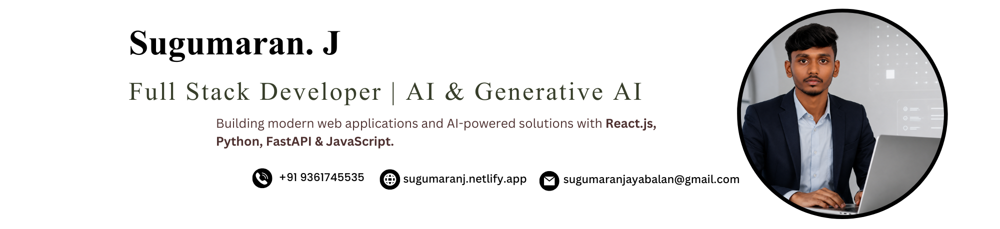
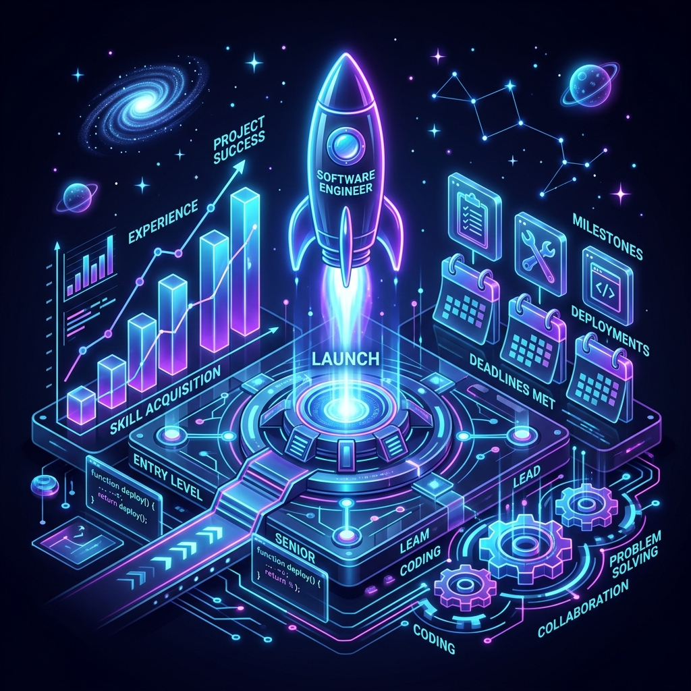

<!-- ============================================================ -->
<!--   SUGUMARAN J — MODERN GITHUB PROFILE & PORTFOLIO          -->
<!-- ============================================================ -->

<p align="center">
  
</p>

<p align="center">
  <a href="https://github.com/SugumaranJ-2022">
    
  </a>
  <a href="https://www.linkedin.com/in/sugumaran-j-a12879254/">
    
  </a>
  <a href="https://sugumaranj.netlify.app/">
    
  </a>
  <a href="mailto:sugumaranjayabalan@gmail.com">
    
  </a>
</p>

<br/>

<table align="center" width="100%" style="border-collapse: collapse; border: none; margin: 20px 0;">
  <tr style="border: none;">
    <td align="center" width="32%" style="border: none; padding: 15px; vertical-align: middle;">
      
      <br/><br/>
      
      <br/>
      
      <br/>
      
    </td>
    <td width="68%" style="border: none; padding: 15px 20px; font-family: -apple-system, BlinkMacSystemFont, 'Segoe UI', Helvetica, Arial, sans-serif; vertical-align: middle; line-height: 1.6;">
<h3>👋 Welcome to my coding playground!</h3>
<p>I am a <strong>Junior Full Stack & Web Developer</strong> and <strong>MCA Student</strong> at <strong>SRM Institute of Science and Technology</strong>. I build modern, resilient web applications that unite responsive frontends, scalable backends, and cutting-edge AI integrations.</p>
<ul>
<li>🎯 Maintained a stellar <strong>9.92 CGPA</strong> in MCA coursework</li>
<li>🚀 Engineered and shipped <strong>12+</strong> full-stack, frontend & AI applications</li>
<li>📜 Published & presented research at the <strong>CIMA 2026 International Conference</strong></li>
<li>🏆 Honored with the <strong>Good Performance Award</strong> during IndiWebPros Internship</li>
<li>💼 Completed <strong>5</strong> industry & virtual internships across Full Stack, AI & Cloud</li>
<li>📜 Earned <strong>10+</strong> certifications across Microsoft, OpenAI & MongoDB</li>
</ul>
<p><em>"Building scalable systems with clean architecture, modern design patterns, and purposeful engineering."</em></p>
    </td>
  </tr>
</table>

---

## ⚡ About Me

<table align="center" width="100%" style="border-collapse: collapse; border: none; margin: 10px 0;">
  <tr style="border: none;">
    <td width="65%" valign="middle" style="border: none; padding-right: 20px; line-height: 1.6;">
<p>I build modern, responsive, full-stack web applications — from pixel-perfect, reactive client interfaces to scalable REST APIs and intelligent AI systems. I care deeply about performance optimization, clean code principles, and engineering real-world software that delivers tangible value.</p>
<p>My tech journey encompasses building e-commerce platforms, AI productivity suites, static code analysis engines with AST parsing, and university-scale scheduling platforms.</p>
<p><strong>Current Deep Dives:</strong> Next.js, Node.js microservices, Docker containerization, AWS cloud architecture, and System Design.</p>
    </td>
    <td width="35%" align="center" valign="middle" style="border: none;">
      
    </td>
  </tr>
</table>

```yaml
Name:        Sugumaran J
Role:        Junior Full Stack / Web Developer
Education:   MCA @ SRM Institute of Science and Technology (2025 – 2027) | CGPA: 9.92
Core Focus:  React.js | Python / Flask | RESTful APIs | AI & LLM Integrations | Cloud
Portfolio:   https://sugumaranj.netlify.app
Philosophy:  Analyze → Architect → Build → Optimize → Ship
```

---

## 🧠 Tech Stack & Tooling

<table align="center" width="100%" style="border-collapse: collapse; border: none; margin: 10px 0;">
  <tr style="border: none;">
    <td width="35%" align="center" valign="middle" style="border: none; padding-right: 20px;">
      
    </td>
    <td width="65%" valign="middle" style="border: none;">
<div align="center">
<h4>💻 Languages</h4>
<a href="https://skillicons.dev"></a>
<h4>🎨 Frontend</h4>
<a href="https://skillicons.dev"></a>
<h4>⚙️ Backend, Cloud & Database</h4>
<a href="https://skillicons.dev"></a>
<h4>🤖 AI, DevOps & Developer Tools</h4>
<a href="https://skillicons.dev"></a>
</div>
    </td>
  </tr>
</table>

<br/>

| Category | Skills & Technologies | Proficiency |
|---|---|:---:|
| **💻 Languages** | JavaScript (ES6+) · Python · Java · PHP · C · SQL | ⭐⭐⭐⭐⭐ |
| **🎨 Frontend** | React.js · Vite · HTML5 · CSS3 · Tailwind CSS · Bootstrap · Responsive UI | ⭐⭐⭐⭐⭐ |
| **⚙️ Backend** | Python Flask · Django · Node.js · Express · RESTful APIs · Auth/JWT | ⭐⭐⭐⭐☆ |
| **🗄️ Databases** | MySQL · MongoDB · Schema Design · Data Modeling | ⭐⭐⭐⭐☆ |
| **☁️ Cloud & DevOps** | AWS (EC2, S3, Lambda) · Docker (Basics) · Netlify · Vercel · Render | ⭐⭐⭐⭐☆ |
| **🤖 AI & Data** | OpenAI API · Generative AI · AST Code Analysis · NetworkX · Streamlit | ⭐⭐⭐⭐☆ |
| **🛠️ Tools & Practices**| Git · GitHub · Postman · Pylint · Agile / SDLC · OOP · DSA | ⭐⭐⭐⭐⭐ |

---

## 🚀 Featured Projects

<p align="center">
  
</p>

<table width="100%" style="border-collapse: collapse; border: none; margin: 20px 0;">
  <!-- ROW 1 -->
  <tr style="border: none;">
    <td width="50%" valign="top" style="border: none; padding: 15px;">
      <h3>🗓️ SRM AI-Powered Timetable</h3>
      <p>Intelligent timetable management platform tailored for university students with dynamic course scheduling, clash detection, and responsive visualization.</p>
      <p>
        
        
        
        
      </p>
      <p>
        <a href="https://srm-ai-powered-timetable.vercel.app/" target="_blank">
          
        </a>
        <a href="https://github.com/SugumaranJ-2022/srm-timetable" target="_blank">
          
        </a>
      </p>
    </td>
    <td width="50%" valign="top" style="border: none; padding: 15px;">
      <h3>🛡️ VeriMedia AI — Synthetic Media Verification</h3>
      <p>Computer vision and machine learning platform designed to verify digital media authenticity and detect manipulated, altered, or synthetic media artifacts.</p>
      <p>
        
        
        
      </p>
      <p>
        <a href="https://github.com/SugumaranJ-2022/VeriMedia_AI" target="_blank">
          
        </a>
      </p>
    </td>
  </tr>

  <!-- ROW 2 -->
  <tr style="border: none;">
    <td width="50%" valign="top" style="border: none; padding: 15px;">
      <h3>🤖 Sonnet AI Platform</h3>
      <p>Full-stack AI assistant featuring multi-model routing (GPT-4, Claude Sonnet), smart prompt suggestions, summarization, email generator, and persistent chat.</p>
      <p>
        
        
        
        
      </p>
      <p>
        <a href="https://sonnet-ai.onrender.com/" target="_blank">
          
        </a>
        <a href="https://github.com/SugumaranJ-2022/Sonnet_ai" target="_blank">
          
        </a>
      </p>
    </td>
    <td width="50%" valign="top" style="border: none; padding: 15px;">
      <h3>🧠 AI Code Understanding Platform</h3>
      <p>Repository static analysis tool using Abstract Syntax Trees (AST) and NetworkX to generate dependency graphs, call trees, and automated explanations. <em>(Presented at CIMA 2026)</em></p>
      <p>
        
        
        
        
      </p>
      <p>
        <a href="https://codepilot-ai.onrender.com/" target="_blank">
          
        </a>
        <a href="https://github.com/SugumaranJ-2022/AI-Code-Understanding-Platform" target="_blank">
          
        </a>
      </p>
    </td>
  </tr>

  <!-- ROW 3 -->
  <tr style="border: none;">
    <td width="50%" valign="top" style="border: none; padding: 15px;">
      <h3>🛍️ AJIO Clone — Modern E-Commerce</h3>
      <p>Production-grade e-commerce application developed during IndiWebPros internship. Features product catalogs, coupons, live cart, filtering, ratings, and Firebase integration.</p>
      <p>
        
        
        
        
      </p>
      <p>
        <a href="https://ajio-webapplication.web.app/" target="_blank">
          
        </a>
        <a href="https://github.com/SugumaranJ-2022/ajio" target="_blank">
          
        </a>
      </p>
    </td>
    <td width="50%" valign="top" style="border: none; padding: 15px;">
      <h3>🎟️ PreBooking — Movie Ticket Booking</h3>
      <p>Interactive ticket reservation portal with cinema schedule browsing, dynamic visual seat selection, pricing calculation, and instant booking confirmation.</p>
      <p>
        
        
        
        
      </p>
      <p>
        <a href="https://prebooking-movie.netlify.app/" target="_blank">
          
        </a>
        <a href="https://github.com/SugumaranJ-2022/prebooking" target="_blank">
          
        </a>
      </p>
    </td>
  </tr>

  <!-- ROW 4 -->
  <tr style="border: none;">
    <td width="50%" valign="top" style="border: none; padding: 15px;">
      <h3>🛒 India Bazaar — Retail E-Commerce</h3>
      <p>Modern responsive retail store featuring reactive shopping cart state management, multi-category filtering, instant product search, and mobile-first UX.</p>
      <p>
        
        
        
        
      </p>
      <p>
        <a href="https://indiabazaar.netlify.app/" target="_blank">
          
        </a>
        <a href="https://github.com/SugumaranJ-2022/shopmart-e-commerce" target="_blank">
          
        </a>
      </p>
    </td>
    <td width="50%" valign="top" style="border: none; padding: 15px;">
      <h3>🔍 Flask Code Analyzer & Evaluator</h3>
      <p>Static code quality analysis web application utilizing Pylint and AST engines to audit source code quality across Python, Java, C++, JavaScript, and PHP.</p>
      <p>
        
        
        
        
      </p>
      <p>
        <a href="https://flask-code-analyzer.onrender.com/" target="_blank">
          
        </a>
        <a href="https://github.com/SugumaranJ-2022/flask-code-analyzer" target="_blank">
          
        </a>
      </p>
    </td>
  </tr>

  <!-- ROW 5 -->
  <tr style="border: none;">
    <td width="50%" valign="top" style="border: none; padding: 15px;">
      <h3>🎓 Student Learning Portal (LMS)</h3>
      <p>Role-based management portal (Admin, Faculty, Student) with secure authentication, attendance tracking, course schedules, and relational MySQL data models.</p>
      <p>
        
        
        
        
      </p>
      <p>
        <a href="https://github.com/SugumaranJ-2022/Management_portal" target="_blank">
          
        </a>
      </p>
    </td>
    <td width="50%" valign="top" style="border: none; padding: 15px;">
      <h3>🚗 Car Rental Management System</h3>
      <p>Vehicle reservation and fleet management system featuring end-to-end booking workflows, driver allocations, customer records, and administrative dashboards.</p>
      <p>
        
        
        
      </p>
      <p>
        <a href="https://github.com/SugumaranJ-2022/Car_Rental" target="_blank">
          
        </a>
      </p>
    </td>
  </tr>
</table>

---

## 📜 Research & Conference Publications

<table align="center" width="100%" style="border-collapse: collapse; border: none; margin: 10px 0;">
  <tr style="border: none;">
    <td width="35%" align="center" valign="middle" style="border: none; padding-right: 20px;">
      
    </td>
    <td width="65%" valign="middle" style="border: none; line-height: 1.6;">
<h3>🌐 Fourth International Conference on Computational Intelligence & Mathematical Applications (CIMA-26)</h3>
<p><strong>Organized by:</strong> SRM Institute of Science & Technology & AIMST University, Malaysia</p>
<p><strong>Paper Title:</strong> <em>"AI Code Understanding Platform Using AST-Based Static Analysis"</em></p>
<ul>
<li>Researched automated AST parsing mechanisms to map programmatic dependencies in polyglot codebases.</li>
<li>Implemented directed graph visualizations with NetworkX for interactive module tracing.</li>
<li>Awarded an official <strong>Certificate of Presentation</strong> for academic contribution to AI & Software Engineering.</li>
</ul>
<p>


</p>
    </td>
  </tr>
</table>

---

## 🏆 Honors & Achievements

<table align="center" width="100%" style="border-collapse: collapse; border: none; margin: 10px 0;">
  <tr style="border: none;">
    <td width="65%" valign="middle" style="border: none; padding-right: 20px; line-height: 1.6;">
<ul>
<li>🥇 <strong>Good Performance Award — IndiWebPros Full Stack Internship (Aug 2026):</strong> Recognized for exceptional software engineering, team commitment, and high-quality capstone project delivery.</li>
<li>🎯 <strong>Outstanding Academic Performance Award:</strong> Attained a peak <strong>9.92 CGPA</strong> in Master of Computer Applications coursework at SRM IST.</li>
<li>🎤 <strong>International Conference Presenter (CIMA 2026):</strong> Presented cutting-edge research on AI-driven code analysis to international delegates.</li>
<li>🧠 <strong>AI & ML Adaptive Systems Seminar:</strong> Completed advanced research seminar on machine learning applications in adaptive learning systems and healthcare.</li>
</ul>
    </td>
    <td width="35%" align="center" valign="middle" style="border: none;">
      
    </td>
  </tr>
</table>

---

## 💼 Professional Experience

<table align="center" width="100%" style="border-collapse: collapse; border: none; margin: 10px 0;">
  <tr style="border: none;">
    <td width="65%" valign="middle" style="border: none; padding-right: 20px; line-height: 1.6;">
<h4>⚡ Full Stack Development Intern — IndiWebPros</h4>
<p><code>Jun 2026 – Aug 2026 · Virtual</code> &nbsp; </p>
<ul>
<li>Engineered a full-featured, responsive AJIO e-commerce web platform utilizing <strong>React.js</strong>, <strong>Firebase</strong>, and RESTful APIs.</li>
<li>Developed cart state management, checkout flows, coupon validation, product sorting, and user reviews.</li>
<li>Honored with the <em>Good Performance Award</em> for exemplary teamwork, technical excellence, and dedication.</li>
</ul>
<h4>☁️ AWS AI-Powered Cloud Engineer Intern — AICTE & EduSkills</h4>
<p><code>Apr 2026 – Jun 2026 · Virtual</code></p>
<ul>
<li>Configured scalable cloud infrastructure on <strong>AWS</strong> spanning EC2, S3, RDS, VPC, and AWS Lambda serverless functions.</li>
<li>Explored Generative AI pipelines and cloud-native machine learning deployment architectures.</li>
</ul>
<h4>💻 Web Development Intern — Sysslan IT Solutions</h4>
<p><code>Mar 2026 – May 2026 · Virtual</code></p>
<ul>
<li>Participated in end-to-end web engineering, frontend UI component design, and performance optimizations.</li>
<li>Formulated technical specifications and documentation for client-facing software modules.</li>
</ul>
<h4>🚀 Python Full Stack Developer Intern — AICTE</h4>
<p><code>Jan 2026 – Mar 2026 · Virtual</code></p>
<ul>
<li>Architected REST APIs and relational database schemas leveraging <strong>Python</strong>, <strong>Flask</strong>, <strong>Django</strong>, and <strong>MySQL</strong>.</li>
<li>Engineered backend business logic, validation filters, and secure data handling mechanisms.</li>
</ul>
<h4>💻 Web Development Intern — Oasis Technologies (CADPOINT)</h4>
<p><code>May 2024 – Jun 2024 · On-site</code></p>
<ul>
<li>Crafted cross-browser responsive web pages using <strong>HTML5</strong>, <strong>CSS3</strong>, <strong>JavaScript</strong>, and <strong>Bootstrap</strong>.</li>
<li>Streamlined component rendering and debugged UI bottlenecks for commercial client projects.</li>
</ul>
    </td>
    <td width="35%" align="center" valign="middle" style="border: none;">
      
    </td>
  </tr>
</table>

---

## 🎓 Education

<table align="center" width="100%" style="border-collapse: collapse; border: none; margin: 10px 0;">
  <tr style="border: none;">
    <td width="35%" align="center" valign="middle" style="border: none; padding-right: 20px;">
      
    </td>
    <td width="65%" valign="middle" style="border: none;">
      <table width="100%" style="line-height: 1.6;">
        <thead>
          <tr>
            <th>Degree / Standard</th>
            <th>Institution / University</th>
            <th>Duration</th>
            <th>Score</th>
          </tr>
        </thead>
        <tbody>
          <tr>
            <td><strong>MCA (Master of Computer Applications)</strong></td>
            <td>SRM Institute of Science & Technology (KTR)</td>
            <td><code>2025 – 2027</code></td>
            <td><strong>CGPA 9.92</strong></td>
          </tr>
          <tr>
            <td><strong>BCA (Bachelor of Computer Applications)</strong></td>
            <td>Guru Nanak College (Autonomous)</td>
            <td><code>2022 – 2025</code></td>
            <td><strong>CGPA 8.39</strong></td>
          </tr>
          <tr>
            <td><strong>12th Standard (HSC)</strong></td>
            <td>SC Govt. Boys Higher Secondary School</td>
            <td><code>2022</code></td>
            <td><strong>66.75%</strong></td>
          </tr>
          <tr>
            <td><strong>10th Standard (SSLC)</strong></td>
            <td>Sri Bhagavan Neminatha Hr. Sec. School</td>
            <td><code>2020</code></td>
            <td><strong>83.20%</strong></td>
          </tr>
        </tbody>
      </table>
    </td>
  </tr>
</table>

---

## 📜 Professional Certifications

| Certification Title | Issuing Organization | Domain | Year |
|---|---|---|:---:|
| 🤖 **OpenAI & Generative AI** | SRM University | Artificial Intelligence & LLMs | 2025 |
| 🐍 **Microsoft Python Certification** | Microsoft | Core Python Programming | 2025 |
| 🌐 **Web Development with Python** | Microsoft | Backend Web Architecture | 2025 |
| ⚡ **Advanced Python Development Techniques** | Microsoft | Advanced Software Design | 2025 |
| 💻 **Python Programming Fundamentals** | Microsoft | Algorithms & Data Structures | 2025 |
| 📊 **Data Analysis & Visualization with Python** | Microsoft | Data Science & Pandas | 2025 |
| ⚙️ **Automation and Scripting with Python** | Microsoft | Workflow Automation | 2025 |
| 🍃 **Connecting to MongoDB Database** | MongoDB University | NoSQL & Document Databases | 2024 |
| ⛏️ **Data Mining Part I** | SRM University | Data Mining & Predictive Analytics | 2025 |
| 🚀 **Full Stack Web Developer** | Oasis Technologies / CADPOINT | Web Engineering | 2024 |

---

## 📊 GitHub Analytics

<div align="center">

<p align="center">
  
  
</p>

<p align="center">
  
</p>

<p align="center">
  
</p>

<p align="center">
  
</p>

</div>

---

## 🎯 2026 Goals & Milestones

- [ ] Ship **20+** production-grade full-stack and AI-driven web applications
- [ ] Master modern cloud orchestration with **Docker, Kubernetes & AWS Serverless**
- [ ] Launch an end-to-end **AI SaaS Product** solving real developer problems
- [ ] Solve **500+** Data Structures & Algorithms problems on LeetCode
- [ ] Publish additional academic research on **AI-Assisted Software Development**
- [ ] Secure a **Software Engineer / Full Stack Developer** role at a premier product company

---

## 📫 Let's Connect & Collaborate

<table align="center" width="100%" style="border-collapse: collapse; border: none; margin: 10px 0;">
  <tr style="border: none;">
    <td width="35%" align="center" valign="middle" style="border: none; padding-right: 20px;">
      
    </td>
    <td width="65%" valign="middle" style="border: none;" align="center">
<a href="https://github.com/SugumaranJ-2022">

</a>
<a href="https://www.linkedin.com/in/sugumaran-j-a12879254/">

</a>
<a href="mailto:sugumaranjayabalan@gmail.com">

</a>
<a href="https://sugumaranj.netlify.app/">

</a>
<br/><br/>

    </td>
  </tr>
</table>

<p align="center">
  
</p>
